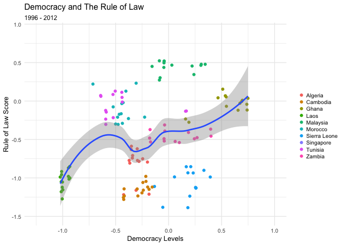
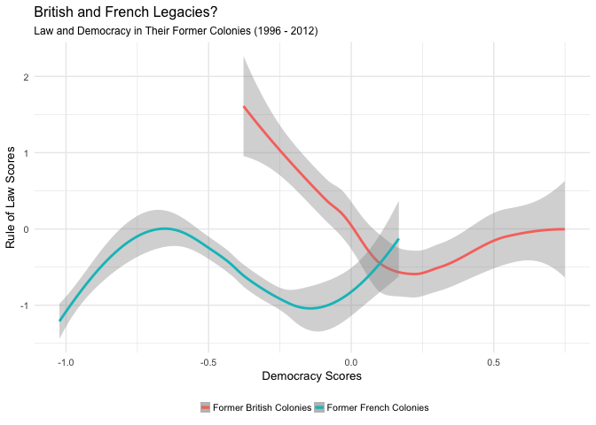
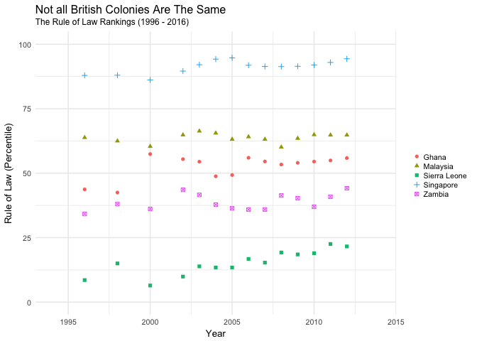
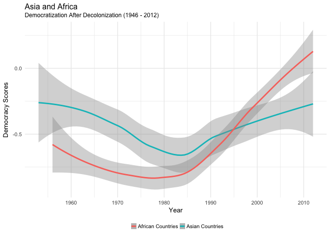
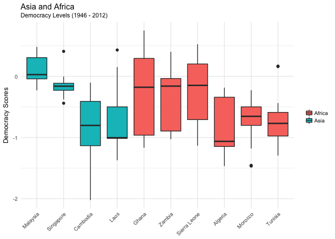
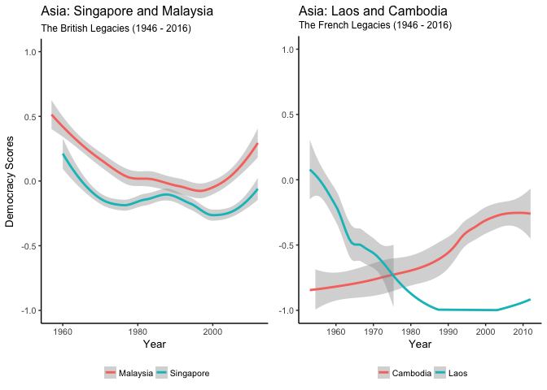

Democracy and The Rule of Law
================
Hoi-Ying Mak
4/26/2018

-   [Introduction](#introduction)
-   [1. Relationship between the rule of law and democracy](#relationship-between-the-rule-of-law-and-democracy)
-   [2. Different Legacies from Britain and France](#different-legacies-from-britain-and-france)
-   [3. Variations Among Former British Colonies](#variations-among-former-british-colonies)
-   [4. Democratization in Asia and Africa (Part I)](#democratization-in-asia-and-africa-part-i)
-   [5. Democratization in Asia and Africa (Part II)](#democratization-in-asia-and-africa-part-ii)
-   [6. Asia: The Dissolved British and French Territories](#asia-the-dissolved-british-and-french-territories)

Introduction
------------

Democracy and the rule of law are often regarded as closely associated universal values. They are also viewed as wonderful legacies that the Western powers have left to their former colonies. Is this really the case? This report revisits the conventional wisdom by looking at the data from 10 Asian and African countries which gained independence from Britain or France after World War II (WWII).

This report uses two sets of data:

1.  [Unified Democracy Scores (UDS)](http://www.unified-democracy-scores.org/uds.html), which incorporates data from 1946 to 2012 from three original measures - Freedom House (2014), Polity IV (Marshall et al. 2012) and VanHanen (2012).

2.  [World Bank's Rule of Law Index](http://databank.worldbank.org/data/reports.aspx?source=worldwide-governance-indicators#), a subset of its governance indicators, measures and ranks the public's trust in a country's rule of law from 1996 to 2016.

In this report, I select a sample of 10 countries , including five former British colonies (Malaysia, Singapore, Zambia, Ghana, Sierra Leone), and five former French colonies (Cambodia, Laos, Morocco, Algeria, Tunisia). Each group is composed of two Asian countries and three African countries.

1. Relationship between the rule of law and democracy
-----------------------------------------------------

The following line graph shows the general bivariate relationship between the levels of democracy and the estimate scores of the rule of law. It covers years 1996 to 2012 as this is the time frame the two datasets have in common.

The loess line shows a crude positive relationship between the level of democracy and the estimated score of the rule of law.

However, the colored dotted plot shows huge variations among different countries. For instance, Tunisia (in fuchsia) has acceptable quality of rule of law (~ 0), but low democracy scores (~ -0.5). On the other hand, Sierra Leone (in light blue) has low rule of law scores (-0.75) but relatively better democracy scores (~ 0).

What are the determinants behind these variations among the 10 countries? The following graphs explore potential influence from different colonial powers (Britain VS France) and regions (Asia VS Africa).

2. Different Legacies from Britain and France
---------------------------------------------

The following graph compare the law and democracy scores of two group of countries - former British colonies, and former French colonies.

The comparison shows former British colonies generally have a significantly higher level of democracy, and moderately better rule of law (the red line is located on the right, upper hand side).

Interestingly, the former British colonies line has shown a negative relationship between the rule of law and democracy. At the left end of red line are countries that have excellent scores rule of law (&gt;1.5) but low democracy levels (&lt;0.25). It can be explained by the British empire's strategic emphasis on constructing a legal complex, rather than a democratic government, as a form of domination over its colonies.

3. Variations Among Former British Colonies
-------------------------------------------

The following graph compares the world rankings (in percentile) of the rule of law of the five British colonies.

The above graph demonstrates huge variations between different British colonies. On the higher end, Singapore (in blue), which has a renowoned legal system, has consistently ranked at the world top (&gt; 80th percentile) in its performance of the rule of law. On the contrary, the African country Sierra Leone has never made its way out of the lower quartile (25th percentile) in its quality of the rule of law after 1996.

Therefore, while the British legacy may have to a certain extent shaped the political institutions in these countries in the post-colonial era, the endogenous political and cultural tradition of each of these countries has obviously played an imperative role as well.

4. Democratization in Asia and Africa (Part I)
----------------------------------------------

The following graph compares the change of levels of democracy in Asian and African former colonies from 1946 to 2012.

The above graph shows the African countries, which initially lagged behind the Asian countries before 1990, have surpassed the latter by embarking a huge progress in democratization in the past two decades.

Nevertheless, both groups of countries have demonstrated similarly low scores of democracy (mostly &lt; 0). It can be explained with the lack-of-democracy nature of colonial rule, which has profound impact on shaping the post-colonial institutions in these countries.

5. Democratization in Asia and Africa (Part II)
-----------------------------------------------

The following graph details the range of democracy scores of each of the 10 countries during 1946 to 2012.

The above boxplot shows African countries generally have a more significant change in their democracy scores between 1946 and 2012. It can reflect a more robust democratization, or more unstable governance that keeps swinging between democracy and authoritarian rule. The Asian countries, specifically Singapore, show a much more consistent performance in democracy throughout this period of time.

6. Asia: The Dissolved British and French Territories
-----------------------------------------------------

The following graphs compares democracy of two interesting pairs: 1) Malyaisa and Singapore, which were separated from the dissolved British Malaya; 2) Laos and Cambodia, which were separated from the dissolved French Indochina.

The above graphs show the former British-ruled twins - Malaysia and Singapore, has generally better scores in levels of democracy. Their performance are rather stable. On the other hand, the former French-ruled twins - Cambodia and Laos, shows a more robust democracy score change throughout the past six decades. Cambodia, in particular, has made remarkable progress in improving its democracy, moving from almost -1.0, to &gt; -0.5 in the latest data.
